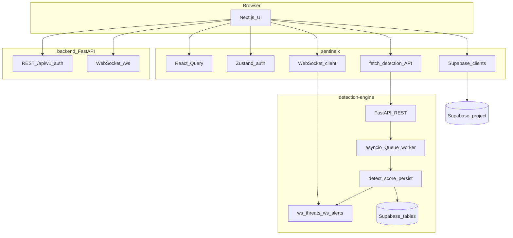

# SentinelX — Project Reference (Detailed)

This document explains the **SentinelX** repository for an industry audience: what it contains, how subsystems fit together, and which behaviors are implemented versus scaffolded. Statements are tied to files and configuration in the tree unless explicitly labeled as a **repository caveat** (configuration inconsistency).

**Real-time operational data** is delivered primarily via the **WebSocket protocol** (browser `WebSocket` API): the UI opens long-lived connections to backend services, which **push** JSON events as logs are ingested, threats are scored, alerts fire, incidents are created, and SOAR-style actions are simulated. **REST** is used for request/response calls (health, ingest, scoring endpoints); **WebSockets** are the mechanism for live dashboards and multi-client synchronization (see `sentinelx/README.md` realtime test flow using `POST /simulate/burst`).

---

## 1. Technologies & Tools Used

### 1.1 Frontend — `sentinelx/` (Next.js application)

The UI is a **Next.js 16** application using the **App Router** (`src/app/`), **React 18** (runtime), and **TypeScript**. Styling uses **Tailwind CSS 4** with **Radix UI** primitives for accessible dialogs, menus, selects, tabs, and toasts. Icons come from **lucide-react**; motion from **framer-motion**.

**WebSockets (client):** There is no separate npm package for WebSockets — the app uses the **standard browser WebSocket API** inside React hooks and helpers (`use-realtime-socket`, `use-detection-realtime`, `use-websocket`, `use-websocket-live`, and `detectionAPI.connectToThreats` / `connectToAlerts` in `src/lib/api/detection.ts`). Production-style routing can terminate TLS and upgrade connections via **Nginx** (`location /ws` → backend upstream with `Upgrade` / `Connection` headers).

| Category | Packages (from `sentinelx/package.json`) | Role in the project |
|----------|-------------------------------------------|---------------------|
| Framework | `next` 16.2.1, `react` ^18.3.1, `react-dom` ^18.3.1 | Server/client components, routing, rendering |
| Type system | `typescript` ^5, `@types/node` ^20, `@types/react` ^19, `@types/react-dom` ^19 | Compile-time typing (React types are ^19 while runtime React is 18) |
| Styling | `tailwindcss` ^4, `@tailwindcss/postcss` ^4, `clsx` ^2.1.1, `tailwind-merge` ^3.5.0 | Utility CSS, conditional class names |
| UI primitives | `@radix-ui/react-*` (dialog, dropdown-menu, select, tabs, toast) | Headless accessible components |
| Data fetching / state | `@tanstack/react-query` ^5.96.0, `zustand` ^5.0.12 | **REST-ish** server state in `AppProviders` (30s staleTime, no refetch on focus); **live** SOC data often comes from **WebSocket** hooks alongside or instead of polling |
| Validation | `zod` ^4.3.6 | API/payload schemas in `src/lib/validation/schemas.ts` |
| HTTP / parsing | `axios` ^1.14.0, `papaparse` ^5.5.3, `dotenv` ^17.3.1 | Client HTTP, CSV/parse workflows where used, env loading in tooling |
| Auth / backend-as-a-service | `@supabase/supabase-js` ^2.101.1, `@supabase/ssr` ^0.10.0, `@supabase/auth-helpers-nextjs` ^0.15.0 | Browser and server Supabase clients; OAuth callback route |
| Visualization | `recharts` ^3.8.1 | Dashboard and analytics charts |
| Maps / geography | `leaflet` ^1.9.4, `react-leaflet` ^4.2.1, `leaflet.heat` ^0.2.0, `mapbox-gl` ^3.21.0, `react-map-gl` ^8.1.0, `react-simple-maps` ^3.0.0 | Threat maps and geo layers (`src/components/maps/`) |
| Animation / misc | `framer-motion` ^12.38.0, `date-fns` ^4.1.0 | Page motion, date formatting |
| Lint | `eslint` ^9, `eslint-config-next` 16.2.1 | `npm run lint` |

**Root layout** (`src/app/layout.tsx`): loads **Geist** and **Geist Mono** via `next/font/google`, wraps the tree with `ErrorBoundary`, `ThemeProvider` (`src/context/ThemeContext.tsx`), and `AppProviders` (React Query).

**Scripts**: `dev` → Next on port **3000**; `build` / `start` for production.

---

### 1.2 Backend — Detection engine (`sentinelx/detection-engine/`)

A **separate FastAPI process** (single `main.py`, version **0.2.0** in code) focused on **ingest → detect → score → WebSocket broadcast → optional Supabase persistence**. This service is the **primary source of real-time security events** for the SOC UI when configured: after HTTP ingest returns `accepted`, the async worker emits **push** messages to subscribed clients.

| Package | Version (`requirements.txt`) | Role |
|---------|-------------------------------|------|
| fastapi | 0.116.1 | HTTP API + **WebSocket** endpoints (`/ws/threats`, `/ws/alerts`) |
| uvicorn | 0.35.0 | ASGI server (HTTP and WebSocket upgrade) |
| pydantic | 2.11.9 | Request/response models (`DetectPayload`, `ScorePayload`, `IngestLogPayload`, `AlertPayload`) |
| websockets | 15.0.1 | Low-level WebSocket dependency (used by Starlette/FastAPI for WS I/O) |
| supabase | unpinned | Python client when `SUPABASE_URL` + `SUPABASE_SERVICE_ROLE_KEY` are set |
| prometheus-client | 0.22.1 | Counters/histograms, `GET /metrics` |
| numpy, pandas, scikit-learn | unpinned | **Declared only** — no imports in `main.py` |

**CORS** (in code): `allow_origins=["http://localhost:3000"]`.

---

### 1.3 Backend — API service (`backend/`)

A **second FastAPI application** intended for a fuller REST/WebSocket platform: **SQLAlchemy**, **Alembic**, **Redis** clients, JWT-related libraries, and **pytest** / formatters in requirements.

| Package | Version | Role |
|---------|---------|------|
| fastapi | 0.104.1 | App entry `app/main.py` |
| uvicorn[standard] | 0.24.0 | ASGI |
| sqlalchemy | 2.0.23 | ORM (`app/models/`) |
| alembic | 1.12.1 | Migrations (tooling present) |
| psycopg2-binary, asyncpg | 2.9.9 / 0.29.0 | PostgreSQL |
| redis, aioredis | 5.0.1 / 2.0.1 | Caching/pub-sub (startup paths largely commented) |
| python-jose, passlib | 3.3.0 / 1.7.4 | Token/password tooling |
| pydantic / pydantic-settings | 2.5.0 / 2.1.0 | Settings in `app/core/config.py` |

**Dockerfile**: **Python 3.9-slim**, exposes **8000**, runs `uvicorn app.main:app --host 0.0.0.0 --port 8000`.

---

### 1.4 Database & persistence

**Supabase-oriented DDL** — `sentinelx/supabase/schema.sql` defines PostgreSQL-compatible tables and constraints:

- **Identity / tenancy**: `users` (roles `admin`, `analyst`, `viewer`), `organizations`, `organization_members`.
- **Telemetry**: `logs` (ip, timestamp, type, `raw_data`/`parsed_data` jsonb, severity enum, optional `organization_id`) with indexes on time, ip, severity, and `(organization_id, timestamp)`.
- **Detection lifecycle**: `threats` (score 0–100, source_ip, vector, location, severity), `alerts` (FK to threats, status, assignee, dedup/group keys), `incidents` + `incident_logs` (many-to-many log linkage).
- **Governance**: `audit_logs` (actor user/system, action, resource, metadata jsonb), `detection_rules` (per-org, `rule_type`, `config` jsonb), `api_keys` (hashed keys, optional `last_used_at`).
- **UX**: `notifications` per user.

**Docker Compose** (`docker-compose.production.yml`) adds **Postgres 15-alpine** and **Redis 7-alpine** for the `backend` service with env-driven credentials and healthchecks — independent of the Supabase SQL file, but both are PostgreSQL-flavored.

---

### 1.5 DevOps, hosting, and CI

| Item | Location | What it does |
|------|----------|--------------|
| Production compose | `docker-compose.production.yml` | Services: `postgres`, `redis`, `backend`, `frontend`, `nginx`, `prometheus`, `grafana`; bridge network `172.20.0.0/16`; named volumes for data |
| Backend image | `backend/Dockerfile` | Installs deps, non-root `app` user, dirs `logs`, `detection_rules`, `soar_playbooks` |
| Frontend image | `sentinelx/Dockerfile.production` | Node **18** Alpine multi-stage: `npm ci --only=production`, `npm run build`, `.next/standalone` runner pattern |
| Reverse proxy | `nginx/nginx.conf` | Upstreams `backend:8000`, `frontend:3000`; proxies **`/api/`** to backend; **`/ws`** to backend with **HTTP → WebSocket upgrade** (`Upgrade`, `Connection`, long read/send timeouts); `/` to frontend; gzip; security headers; static cache; `location /health` returns 200 text |
| Vercel | `sentinelx/vercel.json` | `@vercel/next` build; default public env for app name/version/auth provider |
| GitHub Actions | `sentinelx/.github/workflows/ci.yml` | **Node 20**: `npm ci`, lint, build in `sentinelx/`; **Python 3.12**: pip install + `py_compile` for `detection-engine/main.py` |

**Next.js build config** (`sentinelx/next.config.ts`): `trailingSlash: true`, unoptimized images, `typescript.ignoreBuildErrors: true`, injected `NEXT_PUBLIC_*` defaults, `removeConsole` in production.

---

### 1.6 Observability

- **Detection engine**: Prometheus **Counter** / **Histogram** metrics (requests by method/path/status, latency, **WebSocket** connection counts by channel, detection event types); `GET /metrics` returns Prometheus text format.
- **Monitoring folder**: `monitoring/prometheus.yml` defines scrape jobs (backend, nginx, node-exporter) — see **Appendix** for file/target gaps.
- **Grafana**: `monitoring/grafana/provisioning/datasources/prometheus.yml` points default datasource to `http://prometheus:9090`; dashboard JSON under `provisioning/dashboards/`.

---

## 2. Project Overview

### 2.1 Problem space

SentinelX is positioned as an **enterprise threat intelligence, SIEM, and SOAR-style platform scaffold** (as stated in `sentinelx/README.md` and root layout metadata). It addresses **security operations workflows** in code: surfacing alerts and incidents, exploring logs, viewing detection activity, configuring settings, and simulating response automation.

**Live updates** are modeled as a **push** architecture: the browser maintains **WebSocket** connections so that when telemetry is processed (e.g. after `POST /ingest-log` or `POST /simulate/burst`), **all connected tabs** receive the same JSON events without polling. REST configures and triggers work; **WebSockets carry the real-time stream**.

### 2.2 Architectural layers

1. **Presentation** — Next.js app in `sentinelx/`: landing, auth pages, and a **SOC shell** (sidebar + topbar) for operational pages. Feature hooks open **WebSocket** clients where real-time mode is enabled (some hooks use **mock** timers instead; see §3.5).
2. **Real-time detection service** — `sentinelx/detection-engine/main.py`: accepts **REST** log ingest, applies **rule-based** checks, computes a **numeric risk score**, then **`ConnectionManager.broadcast`** sends JSON over **`/ws/threats`** and **`/ws/alerts`**; optionally persists to Supabase **after** or **alongside** the push.
3. **Platform API (optional)** — `backend/app`: FastAPI with health, docs, a second **WebSocket** hub at **`/ws`** (broadcast to all connected clients; message types like `alerts:update`), and **currently wired** v1 **auth** routes only; Redis-backed fan-out is partially scaffolded but disabled in lifespan.
4. **Data** — Either **Supabase** (schema SQL + service role from the engine) or **Compose Postgres/Redis** for the backend stack, depending on deployment path.

### 2.3 WebSocket channels and event shapes (detection engine)

The detection engine multiplexes **logical channels** by **URL path** (each path has its own subscriber set in `ConnectionManager`):

| WebSocket path | Typical push payload pattern | Purpose |
|----------------|------------------------------|---------|
| `/ws/threats` | `{ "type": "log" \| "threat" \| "system", "data"?: …, "at": ISO timestamp }` | **Log lines** and **threat** objects as they are produced; **system** welcome on connect |
| `/ws/alerts` | `{ "type": "alert" \| "incident" \| "soar_action" \| "system", … }` | **Alerts**, **incidents**, **simulated SOAR actions**; **system** welcome on connect |

On connect, the server sends a **`system`** message per channel (`message: "connected"`). **SOAR** simulations use `type: "soar_action"` on the **`alerts`** channel. This split lets the UI subscribe to a **threat/log feed** vs an **alerting/response feed** independently (many hooks open **both** sockets).

### 2.4 Interaction diagram

Solid lines to **`WS_DE`** / **`WS_BE`** represent **persistent WebSocket** connections used for **server → client** real-time data.

### 2.5 Request path — detection ingest (concrete)

1. Client or tool `POST`s **`/ingest-log`** with JSON matching `IngestLogPayload` (ip, timestamp, type, severity, `raw_data`).
2. Optional header **`x-api-key`** is checked against **`SENTINELX_INGEST_API_KEY`** when that env var is non-empty; otherwise ingest is open in dev-style mode (as documented in code comments).
3. Payload is **`put_nowait`** on **`processing_queue`** (max 10,000); the HTTP handler returns quickly with `{"status": "accepted"}`.
4. A **startup worker** drains the queue and calls **`_process_ingest`**: maps log to **`DetectPayload`**, runs **`detect()`**, builds a **log event**, **broadcasts** `type: "log"` on channel **`threats`**, persists log if Supabase enabled, writes **`audit_logs`** row for `log_ingested`.
5. If findings exist: builds **threat**, **WebSocket-broadcasts** on **`threats`**, may create **alert** if score ≥ **75** with **deduplication** (same dedup key within **600 seconds**), **broadcasts** on **`alerts`**, may create **incident** if score ≥ **90** or `account_takeover` in findings, runs **`_execute_soar_actions`** (e.g. score ≥ **80** → simulated `block_ip`; account takeover → `mark_threat`), **WebSocket-broadcasting** **`soar_action`** on **`alerts`**.

Each **`broadcast`** is a **push** to every socket in that channel — this is what keeps multiple browser tabs in sync for the realtime demo flow.

### 2.6 Directory map (high level)

| Path | Contents |
|------|----------|
| `sentinelx/src/app/` | App Router pages: `(soc)/*`, `login`, `signup`, `auth/*`, `unauthorized`, `page.tsx` (landing) |
| `sentinelx/src/components/` | Feature UI: `dashboard`, `logs`, `alerts`, `incidents`, `detection`, `soar`, `settings`, `maps`, `layout`, `landing`, `navigation` |
| `sentinelx/src/hooks/` | Data and realtime hooks (`use-dashboard`, `use-alerts`, `use-detection-realtime`, `use-realtime-socket`, etc.) |
| `sentinelx/src/lib/` | `api`, `supabase`, `auth`, `validation`, `security`, `data/mock` |
| `sentinelx/detection-engine/` | `main.py`, `requirements.txt`, README |
| `backend/app/` | `main.py`, `api/`, `models/`, `services/`, `core/config.py` |

---

## 3. Features

### 3.1 Marketing & landing

- **`src/app/page.tsx`**: Composes landing sections (`hero-aligned-enhanced`, features, live preview, trust, footer-simple), uses **`useAuth`** for `checkAuth` and redirects authenticated users toward **`/dashboard`**.
- **Landing components** (`src/components/landing/`): multiple hero variants exist in the repo; the active page imports **hero-aligned-enhanced** and **footer-simple**.

### 3.2 Authentication & session

- **Routes**: `login`, `signup`, `auth/login`, `auth/signup`, **`auth/callback/route.ts`** (Supabase OAuth callback handling).
- **`use-auth.ts`**: **Zustand** store with **`persist`** middleware. **`USE_MOCK_AUTH = true`** forces **client-side mock login** (hard-coded demo emails/passwords) and writes **`token`** / **`user`** to **localStorage** without calling the backend for credentials. **`API_BASE_URL`** defaults to `http://localhost:8080/api/v1` for other flows when extended.
- **Supabase hooks** (multiple files): alternate integration paths for session management (`use-supabase-auth*.tsx`, `use-supabase-simple.tsx`).
- **Sidebar logout** (`ModernSidebar.tsx`): clears **localStorage** `token`/`user`, calls Zustand **`logout`**, redirects to **`/`**.

### 3.3 SOC console navigation & shell

- **`(soc)/layout.tsx`**: Full-height flex layout; **desktop** sidebar from **`ModernSidebar`**; **mobile** overlay drawer; **`TopbarEnhanced`** with menu toggle.
- **`ModernSidebar.tsx`**: Declares **nav items** (href + label + icon + badge counts): `/dashboard`, `/logs`, `/alerts`, `/incidents`, `/intel`, `/soar`, `/settings` — matching **`(soc)`** routes.

### 3.4 Feature pages (by route)

| Route | Representative implementation |
|-------|------------------------------|
| `/dashboard` | `dashboard/page.tsx` + `components/dashboard/*`, `hooks/use-dashboard.ts` (**`USE_MOCK_DATA = true`** explicitly **turns off** live **WebSocket** usage and uses static mock KPIs/trends/maps — set to false and align env URLs to use real-time WS feeds) |
| `/logs` | `logs/*`, `components/logs/*`, `hooks/use-logs.ts` |
| `/alerts` | `alerts/page.tsx`, `hooks/use-alerts.ts` |
| `/incidents` | `incidents/*`, `components/incidents/*`, `hooks/use-incidents.ts` |
| `/detection` | `detection/*`, `components/detection/*`, `hooks/use-detection.ts`, `use-detection-realtime.ts` |
| `/intel` | `intel/page.tsx` — threat intel surface |
| `/soar` | `soar/page.tsx`, `components/soar/*`, `hooks/use-soar.ts` |
| `/settings` | `settings/page.tsx`, `components/settings/*` (account, API keys, security, users/roles, preferences) |

Each area combines **presentational components** with **hooks** that either fetch **REST** data, open **WebSocket** subscriptions for **push** updates, or use **mock timers/data** depending on the hook implementation.

### 3.5 WebSockets for real-time data (primary live path)

Operational “live” behavior is implemented as **bidirectional-capable WebSocket connections** where the **server drives updates**: the client connects, receives a **`system`** handshake message, then processes **`message`** events with JSON bodies. Reconnect logic is implemented in several hooks so brief engine restarts do not permanently drop the UI.

**Detection engine (recommended for SOC realtime demo in README)**

| Client artifact | Behavior |
|-----------------|----------|
| **`src/hooks/use-realtime-socket.ts`** | Generic hook: URL from **`NEXT_PUBLIC_DETECTION_ENGINE_WS_URL`**, else **`ws`/`wss` + `window.location.hostname` + `:8001` + endpoint path**; parses JSON to **`RealtimeEvent`**; **exponential backoff** reconnect (max delay 10s). |
| **`src/hooks/use-detection-realtime.ts`** | Opens **two** sockets: **`NEXT_PUBLIC_WS_URL`/default `ws://localhost:8000`** + **`/ws/threats`** and **`/ws/alerts`**; routes messages by `type` (`log`, `threat`, `alert`, `incident`, `soar_action`, etc.) into local state. |
| **`src/lib/api/detection.ts`** | **`connectToThreats()`** / **`connectToAlerts()`** return raw **`WebSocket`** instances against **`NEXT_PUBLIC_WS_URL`** (default **`ws://localhost:8000`**). Same file uses **REST** for **`ingestLog`**, **`executeSOAR`**, **`healthCheck`**, etc. |

**Platform backend (`backend/`) — alternate WebSocket hub**

| Client artifact | Behavior |
|-----------------|----------|
| **`src/hooks/use-websocket.ts`** | Uses **`apiClient.createWebSocket()`** from **`src/lib/api-client.ts`** (defaults **`ws://localhost:8000/ws`**) for a single connection to the **monolithic** FastAPI **`/ws`** endpoint. |
| **`src/hooks/use-websocket-live.ts`** | Can run against a URL or, when not wired to a server, **generates mock** `alerts:update` / `incidents:update`-style messages on an interval — useful for UI demos **without** a live socket. |

**REST vs WebSocket (division of labor)**

- **REST** (`POST /ingest-log`, `POST /detect`, …): submit work, trigger simulations, read health.
- **WebSocket**: receive **continuous** `log`, `threat`, `alert`, `incident`, `soar_action` (and `system`) payloads as the engine processes the queue.

**Configuration caveat:** Default hosts/ports differ across **`use-realtime-socket` (8001)**, **`detection.ts` / `use-detection-realtime` (8000)**, and **`use-auth` REST (8080)** — set **`NEXT_PUBLIC_DETECTION_ENGINE_WS_URL`**, **`NEXT_PUBLIC_WS_URL`**, and **`NEXT_PUBLIC_API_URL`** so all clients target the same running service.

**Unimplemented REST on detection engine:** **`lib/api/detection.ts`** also calls **`/rules`**, **`/detections`**, **`/analytics`** — these routes are **not** defined on `detection-engine/main.py` in this repo (WebSocket + listed POST/GET paths are the implemented surface there).

### 3.6 Detection engine API surface (implemented)

| Method | Path | Behavior |
|--------|------|----------|
| GET | `/health` | JSON status + `supabase_enabled` |
| GET | `/metrics` | Prometheus scrape text |
| POST | `/detect` | Rule findings + correlated flag |
| POST | `/score` | 0–100 risk score |
| POST | `/analyze` | Combined risk label + evidence |
| POST | `/ingest-log` | Queue for async processing |
| POST | `/alerts/create` | Create alert, broadcast, optional Supabase |
| POST | `/soar/execute` | Synthetic threat + SOAR action broadcast |
| POST | `/maintenance/retention` | Delete old `logs` in Supabase by `LOG_RETENTION_DAYS` (default 30) when configured |
| POST | `/simulate/burst` | Ten synthetic ingests for multi-tab testing |
| WS | `/ws/threats`, `/ws/alerts` | **Real-time channel**: join; server **pushes** JSON events (`log`, `threat`, `alert`, `incident`, `soar_action`, `system`) to all subscribers on that path |

### 3.7 Backend FastAPI (`backend/app/main.py`) — implemented routes

- **`GET /`**, **`GET /health`**: API discovery and health JSON (Redis checks **disabled** in code path; returns static/disabled statuses).
- **`GET /docs`**, **`GET /redoc`**: OpenAPI UIs.
- **Router prefix** **`/api/v1`** includes **only** **`auth`** submodule: **`/api/v1/auth/test`**, **`/api/v1/auth/login`**, **`/api/v1/auth/me`** (see `app/api/v1/auth.py` using **`dev_auth_service`**).
- **Duplicate dev endpoints** on app: **`/api/v1/auth/test`** and **`/api/v1/auth/login`** also defined directly on `app` in `main.py` (simple dict login).
- **WebSocket `/ws`**: **`ConnectionManager`** — **full-mesh broadcast** WebSocket hub: every connected client can receive messages sent by the server or relayed from other clients’ JSON payloads. Optional JWT validation via **`auth_service`** if `token` query param provided. Incoming client JSON with `type` in `alerts:update`, `logs:update`, `threats:update`, `incidents:update` is **re-broadcast** to **all** connections (pattern differs from the detection engine’s **two-channel** `threats`/`alerts` split).
- **Lifespan**: Redis connect, detection engine, SOAR engine — **commented out**; logs indicate **development mode**.
- **Startup**: **`broadcast_redis_messages`** task is registered; Redis client usage in lifespan is disabled — operational effect depends on runtime (**may error** if `redis_client` not connected).

**Unwired Python modules**: `app/api/v1/alerts.py`, `dashboard.py`, `logs.py` exist but are **not** `include_router`’d in `app/api/v1/__init__.py`.

### 3.8 Validation, RBAC, and rate limiting

- **`lib/validation/schemas.ts`**: **Zod** — `ingestLogSchema` (IPv4, ISO datetime, severity enum), `parseLogSchema`, `alertCreateSchema`, `incidentCreateSchema`.
- **`lib/auth/rbac.ts`**: Reads **`x-sentinelx-role`** header; **`hasRoleAccess`** uses ordering viewer < analyst < admin.
- **`lib/security/rate-limit.ts`**: **In-memory** fixed window per key (default 120 requests / 60s); not distributed across instances.

### 3.9 Global UI infrastructure

- **`AppProviders`**: **`QueryClient`** with **30s** `staleTime`, **`refetchOnWindowFocus: false`**.
- **`ErrorBoundary`**: Catches render errors in the shell.
- **`ThemeContext`**: Dark/light theming (consumed by sidebar and **ThemeToggle**).

---

## 4. Industry-Level Summary

**SentinelX** demonstrates how a **security operations product** can separate **analyst-facing experience** (Next.js) from **high-churn telemetry processing** (FastAPI detection engine) while optionally anchoring **auditability and multi-tenant structure** in PostgreSQL (Supabase DDL or self-hosted Postgres). **WebSockets** are the **primary mechanism** for delivering **sub-second, multi-subscriber** updates to analysts (multiple browser tabs, future wallboards) once ingest or simulation endpoints generate events.

**Business value:** Stakeholders get a **credible UI walkthrough** of SIEM/SOAR concepts — log flood, detection signals, alert deduplication, incident creation thresholds, and **simulated** response actions — **pushed live** over WebSockets rather than relying on refresh or coarse polling. The **Prometheus metrics** hook on the engine (including **WebSocket connection** counters) supports **SRE-style** observation of ingest, detection volume, and connection churn in principle.

**Real-world use cases:** **Pilot SOC consoles**, **training environments**, **integration demos** (**HTTP ingest** + **WebSocket fan-out** to many viewers), and **architecture references** for splitting “glass” (UI) from “engine” (Python service) with an explicit **push** channel.

**Scalability (factual):** The detection engine’s **in-process queue** and **in-memory dedup cache** are **single-instance** patterns. **WebSocket** fan-out is **O(n)** per event over **all sockets on that channel** — acceptable at modest analyst counts; large deployments typically add **shared pub/sub** (e.g. Redis, Kafka) and **connection gateways**. **Supabase** inserts run in a **thread pool** via **`asyncio.to_thread`**. Scaling out requires **external queues**, **shared deduplication**, **sticky sessions or centralized pub/sub** for WebSockets, and **hardening auth** beyond mock and dev keys — which aligns with the **“Phase 1 / next phases”** language in `sentinelx/README.md`.

---

## Appendix — Repository caveats (factual)

| Topic | Detail |
|-------|--------|
| Compose ↔ Dockerfile ports | `docker-compose.production.yml` maps **`8080:8080`** for `backend` while the backend container listens on **8000** per `backend/Dockerfile` — internal healthcheck uses **8000** (consistent with Uvicorn). |
| Frontend Dockerfile name | Compose references **`sentinelx/Dockerfile`**; repo has **`Dockerfile.production`** under `sentinelx/`. |
| Prometheus file references | `monitoring/prometheus.yml` lists **`prometheus_rules.yml`** and **`node-exporter`**; those files/services are **not** present under `monitoring/` here. Prometheus also uses **`metrics_path: /health`** for backend — that path returns JSON, not Prometheus format (scrape config may not match intent). |
| Host port collision | **Grafana** and **frontend** both map **`3001:3000`** in the same compose file. |
| Nginx rate limit zones | Only one **`limit_req_zone`** line appears (`zone=10m`); **`limit_req`** references **`zone=one`**, **`zone=api`**, **`zone=frontend`** — **zone names do not match** the defined line as written (would need nginx-valid zone definitions to work). |
| Nginx directive | **`more_clear_headers`** requires **headers-more** module; stock **nginx:alpine** may not include it. |
| Frontend port defaults | **8000** vs **8001** vs **8080** defaults appear across **`detection.ts`**, **`use-detection-realtime`**, **`use-realtime-socket`**, **`use-auth`**, **`api-client.ts`** — **environment variables must align** for a working full stack. |
| Nginx `/ws` vs detection engine | **`nginx/nginx.conf`** proxies **`/ws`** to the **`backend`** upstream (`backend:8000`), not to **`sentinelx/detection-engine`**. The compose file does **not** include a **detection-engine** container — WebSocket URLs for the microservice must target wherever Uvicorn runs (e.g. host **8001**) via **`NEXT_PUBLIC_DETECTION_ENGINE_WS_URL`** / **`NEXT_PUBLIC_WS_URL`**, or the stack must be extended with a proxy route. |
| ML dependencies | **numpy / pandas / sklearn** are not used in **`detection-engine/main.py`**. |

---

*This reference is derived from the repository structure and source files. Update it when wiring new routes, changing defaults, or fixing deployment configs.*
